# Data Flow

## Overview

This document describes the key data flows through the Gotong Royong platform, from task creation to reputation updates.

## 1. Task Creation and Assignment Flow


**Steps**:
1. Task organizer creates task with title, description, skills required
2. System validates input and stores in database
3. Task list cache is invalidated
4. Organizer assigns task to specific contributor or leaves open
5. Contributor sees task in their assigned tasks list

**Database Tables Used**:
- `tasks` - Main task record
- `task_skills` - Skills required for task
- `task_assignments` - Assignment history

## 2. Task Completion with Evidence Submission Flow


**Steps**:
1. Contributor marks task as complete and uploads evidence
2. API generates presigned S3 URLs for direct upload
3. Contributor uploads files directly to S3
4. API confirms upload, computes media hashes
5. Database transaction: Create contribution, store evidence, mark task complete
6. Webhook event queued for Markov Engine (async)
7. Background worker delivers webhook with HMAC signature
8. Markov Engine processes event and updates reputation

**Database Tables Used**:
- `contributions` - Contribution record
- `evidence` - Evidence metadata
- `tasks` - Task status update
- `webhook_events` - Event queue

## 3. Proof of Reality (PoR) Evidence Validation Flow


**Validation Rules**:
- **Timestamp**: Must be <= 30 days old
- **Media Hash**: Hex string, minimum 32 characters
- **GPS Coordinates**: Lat (-90, 90), Lon (-180, 180)
- **Witnesses**: At least 1 witness required for attestation

**Error Examples**:
- `"Timestamp is too old: 45 days"`
- `"Invalid latitude: 95.0. Must be between -90 and 90"`
- `"witness_attestation requires at least one witness"`

See [Validation Rules](../por-evidence/validation-rules.md) for complete specifications.

## 4. Vouch Submission Flow

```mermaid
sequenceDiagram
    participant Voucher
    participant API
    participant DB
    participant Queue
    participant Markov

    Voucher->>API: POST /vouch (vouch for another contributor)
    API->>API: Validate voucher has reputation > min threshold
    API->>API: Validate vouchee exists
    API->>API: Check no duplicate vouch (voucher → vouchee, skill)

    API->>DB: INSERT INTO vouches
    DB->>API: vouch_id

    API->>Queue: Enqueue webhook (vouch_submitted)
    API->>Voucher: 200 OK (vouch recorded)

    Queue->>Markov: POST /webhook (vouch_submitted)
    Markov->>Markov: Calculate vouch weight
    Markov->>Markov: Update reputation graph
    Markov->>Queue: 200 OK
```



**Steps**:
1. Voucher submits endorsement for another contributor
2. System validates voucher eligibility (minimum reputation)
3. Check for duplicate vouches (same skill)
4. Store vouch in database
5. Queue webhook for Markov Engine
6. Markov calculates vouch impact on reputation

**Vouch Weight Calculation** (in Markov Engine):
- Based on voucher's own reputation
- Skill-specific weights
- Decay over time (older vouches have less weight)

**Database Tables Used**:
- `vouches` - Vouch records
- `users` - Voucher/vouchee profiles

## 5. Reputation Query Flow


**Caching Strategy**:
- **TTL**: 5 minutes
- **Invalidation**: Optional on webhook success
- **Key**: `reputation:{user_id}`

**Reputation Data Structure**:
```json
{
  "user_id": "user123",
  "reputation_score": 2550,
  "tier": "advanced",
  "contributions_count": 51,
  "vouches_received": 12,
  "skills": [
    { "skill_id": "gardening", "competence": 0.85 },
    { "skill_id": "logistics", "competence": 0.72 }
  ]
}
```

## 6. Verification Consensus Flow


**Consensus Logic** (in Markov Engine):
- Require minimum N verifiers (configurable, default: 3)
- Majority vote determines outcome
- Weight verifications by verifier reputation
- Example: 2 approve + 1 reject = approved (if both approvers have higher reputation)

**Database Tables Used**:
- `verifications` - Individual verification records
- `contributions` - Aggregate verification status

## 7. Task Discovery and Browsing Flow


**Task List Caching**:
- **TTL**: 1 minute (short, because tasks change frequently)
- **Invalidation**: On task creation, assignment, completion
- **Segmentation**: Cache by filters (status, skill, location)

## 8. Multi-Perspective Evidence Submission Flow


**Multi-Perspective Benefits**:
- Higher reputation bonus for multiple evidence types
- Increased tamper resistance
- Better audit trail

**Evidence Quality Score**:
- Single evidence type: 1.0x multiplier
- Two evidence types: 1.2x multiplier
- Three evidence types: 1.5x multiplier

## 9. Webhook Retry and Dead Letter Flow


**Retry Schedule**:
| Attempt | Delay | Action |
|---------|-------|--------|
| 1 | 0s | Immediate |
| 2 | 1s | First retry |
| 3 | 2s | Second retry |
| 4 | 4s | Third retry |
| 5 | 8s | Final retry |
| Failed | - | Move to DLQ |

## 10. Complete End-to-End Flow

**Scenario**: Contributor completes a community gardening task with photo evidence and receives peer vouch


**Reputation Timeline**:
- Initial: 2550
- After task: 2550 + 50 = 2600
- After PoR evidence: 2600 + 20 = 2620
- After vouch: 2620 + 15 = 2635

## Performance Considerations

### Bottlenecks

1. **Evidence Upload**: Large files (photos, videos)
   - **Solution**: Direct S3 upload with presigned URLs

2. **Webhook Delivery**: Synchronous blocking
   - **Solution**: Background job queue (async)

3. **Reputation Queries**: Frequent API calls to Markov
   - **Solution**: Redis caching with 5-minute TTL

### Optimization Strategies

- **Database Indexing**: Index on `user_id`, `task_id`, `status`, `created_at`
- **Connection Pooling**: Reuse HTTP connections to Markov
- **Batch Webhooks**: Send multiple events in single request (future)
- **CDN**: Serve static evidence files from CDN

## Next Steps

For implementation details:
- [Webhook Specification](../api/webhook-spec.md)
- [Event Payloads](../api/event-payloads.md)
- [Database Schema](../database/schema-requirements.md)
- [Evidence Validation](../por-evidence/validation-rules.md)
