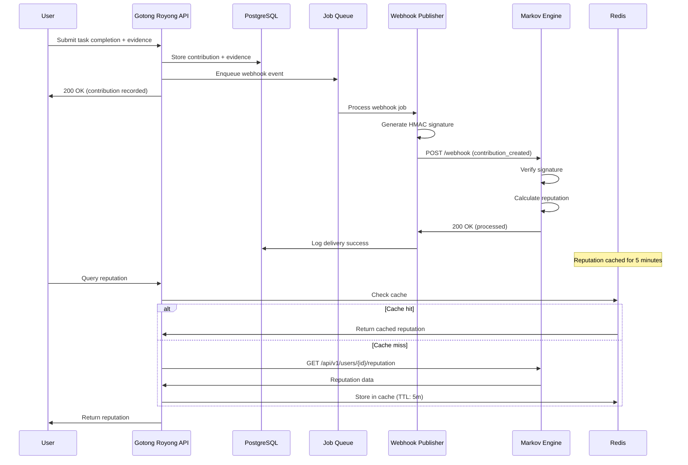

# Integration Architecture

## Overview

Gotong Royong integrates with the Markov Credential Engine using a **Native + Trusted Platform** pattern with webhook-based event publishing and service-to-service read APIs. This document details the technical architecture of this integration.

## Integration Mode: Native (Trusted Platform)

**Native integration** means:
- Gotong Royong has full control over its own database
- Markov Engine does NOT directly access Gotong Royong's database
- Events are published via webhooks to Markov Engine
- Markov Engine processes events and calculates reputation and profiles
- Gotong Royong queries reputation and profile data via Markov API using a platform service token
- Gotong Royong users are auto-provisioned/linked in Markov using trusted platform identities

**Advantages**:
- Clear separation of concerns
- Independent scaling of each system
- Unified security model (webhook signatures + platform service token for read APIs)
- Easier to version and deploy independently
- Transparent user experience (no manual account linking)

## Integration Prerequisites

Before enabling production traffic between Gotong Royong and Markov:

1. Configure a shared webhook secret in both systems.
   - Markov: `GOTONG_ROYONG_WEBHOOK_SECRET`
   - Gotong Royong: outbound webhook signer secret (must match Markov)
2. Configure a platform service token for Gotong → Markov read APIs.
3. Enable trusted-platform auto-linking for `gotong_royong` identities (Markov auto-creates verified links on first event).
4. Use Markov read endpoints with platform-scoped identity `gotong_royong:{user_id}`:
   - `GET /api/v1/users/{id}/reputation`
   - `GET /api/v1/users/{id}/tier`
   - `GET /api/v1/users/{id}/activity`
   - `GET /api/v1/cv-hidup/{user_id}`

## Architecture Diagram



## Communication Patterns

### 1. Webhook Events (Gotong Royong → Markov)

**Purpose**: Notify Markov of contribution/vouch events

**Pattern**: Fire-and-forget with retry

**Protocol**: HTTP POST with HMAC-SHA256 signature

**Event Types**:
- `contribution_created` - Task completed with evidence
- `vouch_submitted` - Peer endorsement
- `por_evidence` - Proof of Reality evidence submitted

**Flow**:
```
1. Gotong Royong: Create contribution in database
2. Gotong Royong: Enqueue webhook job (async)
3. Worker: Pick up job from queue
4. Worker: Generate HMAC-SHA256 signature
5. Worker: POST to Markov webhook endpoint
6. Markov: Verify signature
7. Markov: Parse event and execute domain command
8. Markov: Return 200 OK
9. Worker: Log success and remove job
```

**Error Handling**:
- Retry failed webhooks with exponential backoff
- Max retries: 5
- Backoff: 1s, 2s, 4s, 8s, 16s
- Dead letter queue after max retries

### 2. Reputation + Profile Queries (Gotong Royong → Markov)

**Purpose**: Display user reputation, tier, activity, and CV hidup in Gotong Royong UI

**Pattern**: Request-response with caching

**Protocol**: HTTP GET with platform service authentication (JWT for end-user access remains supported)

**Caching Strategy**:
- Cache reputation data in Redis
- TTL: 5 minutes
- Cache invalidation on webhook success (optional)

**Flow**:
```
1. User requests profile page
2. Check Redis cache for reputation
3. If cached: Return immediately
4. If not cached: GET from Markov API
5. Store result in Redis (5 min TTL)
6. Return to user
```

### 3. Database Access (Markov → Gotong Royong)

**Status**: NOT USED (native integration)

In native mode, Markov does NOT directly access Gotong Royong's database. All data exchange happens via webhooks and API calls.

## Webhook Publisher Implementation

### Architecture

```
┌─────────────────────────────────────────────────────────┐
│ Gotong Royong API                                       │
│                                                         │
│  POST /tasks/{id}/complete                            │
│    ↓                                                    │
│  [1] Store contribution in DB                          │
│    ↓                                                    │
│  [2] Enqueue webhook event                             │
│    ↓                                                    │
│  [3] Return 200 OK to user                             │
└─────────────────────────────────────────────────────────┘
                        ↓
┌─────────────────────────────────────────────────────────┐
│ Background Worker (Bull/Celery/Delayed Job)            │
│                                                         │
│  [1] Dequeue webhook event                             │
│    ↓                                                    │
│  [2] Serialize to JSON                                 │
│    ↓                                                    │
│  [3] Compute HMAC-SHA256 signature                     │
│    ↓                                                    │
│  [4] POST to Markov webhook endpoint                   │
│    ↓                                                    │
│  [5] Handle response (retry on failure)                │
└─────────────────────────────────────────────────────────┘
```

### Code Example (Node.js/TypeScript)

```typescript
import crypto from 'crypto';
import axios from 'axios';

interface WebhookEvent {
  event_type: string;
  actor: { user_id: string; username: string };
  subject: Record<string, any>;
}

class WebhookPublisher {
  private secret: string;
  private markovBaseUrl: string;

  constructor(secret: string, markovBaseUrl: string) {
    this.secret = secret;
    this.markovBaseUrl = markovBaseUrl;
  }

  async publish(event: WebhookEvent): Promise<void> {
    const payload = JSON.stringify(event);
    const signature = this.computeSignature(payload);

    const url = `${this.markovBaseUrl}/api/v1/platforms/gotong_royong/webhook`;

    try {
      const response = await axios.post(url, payload, {
        headers: {
          'Content-Type': 'application/json',
          'X-GR-Signature': `sha256=${signature}`,
        },
        timeout: 10000, // 10 second timeout
      });

      console.log(`Webhook delivered: ${response.status}`);
    } catch (error) {
      console.error(`Webhook failed: ${error.message}`);
      throw error; // Let queue retry
    }
  }

  private computeSignature(payload: string): string {
    return crypto
      .createHmac('sha256', this.secret)
      .update(payload)
      .digest('hex');
  }
}

// Usage in job queue
async function processWebhookJob(job: { data: WebhookEvent }) {
  const publisher = new WebhookPublisher(
    process.env.GOTONG_ROYONG_WEBHOOK_SECRET!,
    process.env.MARKOV_API_URL!
  );

  await publisher.publish(job.data);
}
```

### Job Queue Configuration

**Recommended**: Use Redis-backed job queue

**Options**:
- **Node.js**: Bull or BullMQ
- **Python**: Celery with Redis broker
- **Rust**: Faktory or custom tokio-based queue

**Configuration**:
```javascript
// Bull configuration
const webhookQueue = new Bull('webhook-events', {
  redis: process.env.REDIS_URL,
  defaultJobOptions: {
    attempts: 5,
    backoff: {
      type: 'exponential',
      delay: 1000, // Start with 1 second
    },
    removeOnComplete: true,
    removeOnFail: false, // Keep failed jobs for debugging
  },
});

// Add job to queue
await webhookQueue.add('contribution_created', {
  event_type: 'contribution_created',
  actor: { user_id: 'user123', username: 'alice' },
  subject: { /* event data */ },
});
```

## Retry Logic

### Exponential Backoff

| Attempt | Delay | Cumulative Time |
|---------|-------|-----------------|
| 1 | 0s | 0s |
| 2 | 1s | 1s |
| 3 | 2s | 3s |
| 4 | 4s | 7s |
| 5 | 8s | 15s |

**Total retry window**: ~15 seconds

### Dead Letter Queue

After 5 failed attempts, move to dead letter queue (DLQ):
- Store event in `webhook_failures` table
- Alert operations team
- Manual reprocessing available via admin panel

**Schema**:
```sql
CREATE TABLE webhook_failures (
  id UUID PRIMARY KEY,
  event_type VARCHAR(50) NOT NULL,
  payload JSONB NOT NULL,
  error_message TEXT,
  attempts INT DEFAULT 0,
  last_attempt_at TIMESTAMP,
  created_at TIMESTAMP DEFAULT NOW()
);
```

## Error Handling

### HTTP Status Codes

| Status | Meaning | Action |
|--------|---------|--------|
| 200 | Success | Mark job complete |
| 400 | Bad request (invalid payload) | Move to DLQ (do not retry) |
| 401 | Signature verification failed | Check webhook secret, move to DLQ |
| 429 | Rate limited | Retry with exponential backoff |
| 500 | Server error | Retry with exponential backoff |
| 503 | Service unavailable | Retry with exponential backoff |
| Timeout | Network timeout (>10s) | Retry with exponential backoff |

### Idempotency

**Problem**: Retries may deliver the same event multiple times

**Solution**: Include unique event ID in payload

```json
{
  "event_id": "evt_a1b2c3d4e5",
  "event_type": "contribution_created",
  "actor": { "user_id": "user123", "username": "alice" },
  "subject": { /* event data */ }
}
```

Markov Engine should:
1. Check if `event_id` already processed
2. If yes: Return 200 OK (idempotent)
3. If no: Process event and store `event_id`

## Security

### Webhook Signature Verification

**Algorithm**: HMAC-SHA256

**Header**: `X-GR-Signature: sha256={hex_hash}`

**Computation**:
```
signature = HMAC-SHA256(webhook_secret, raw_request_body)
```

**Verification** (Rust, from Markov Engine adapter):
```rust
use hmac::{Hmac, Mac};
use sha2::Sha256;
use subtle::ConstantTimeEq;

fn verify_hmac(secret: &str, payload: &[u8], signature: &str) -> Result<(), Error> {
    let expected_hash = signature
        .strip_prefix("sha256=")
        .ok_or(Error::InvalidSignature)?;

    let mut mac = Hmac::<Sha256>::new_from_slice(secret.as_bytes())?;
    mac.update(payload);
    let computed_hash = hex::encode(mac.finalize().into_bytes());

    // Constant-time comparison to prevent timing attacks
    if computed_hash.as_bytes().ct_eq(expected_hash.as_bytes()).into() {
        Ok(())
    } else {
        Err(Error::InvalidSignature)
    }
}
```

### Secret Management

**Storage**:
- Development: `.env.local` file (never commit)
- Production: Secrets manager (HashiCorp Vault, AWS Secrets Manager)

**Rotation**:
- Rotate every 90 days
- Support dual secrets during transition (7-day window)
- Log all signature failures for security monitoring

## Monitoring

### Metrics to Track

**Webhook Delivery**:
- `gotong_worker_webhook_delivery_total{result,status_code}` (counter) - Total webhook delivery attempts by outcome
- `gotong_worker_webhook_delivery_duration_ms{result,status_code}` (histogram) - Delivery latency in milliseconds
- `gotong_worker_webhook_dead_letter_total` (gauge) - Current dead-letter outbox depth

**Example Prometheus Query**:
```promql
# Success rate over last 5 minutes
sum(rate(gotong_worker_webhook_delivery_total{result="success"}[5m])) / sum(rate(gotong_worker_webhook_delivery_total[5m])) * 100
```

### Logging

**What to Log**:
- Event type and event ID
- Delivery attempt number
- HTTP status code
- Response time
- Error message (if failed)
- **DO NOT LOG**: Webhook secret, full payload (may contain PII)

**Example Log Entry** (JSON):
```json
{
  "timestamp": "2026-02-10T10:30:00Z",
  "level": "info",
  "service": "webhook-publisher",
  "event_id": "evt_a1b2c3d4e5",
  "event_type": "contribution_created",
  "attempt": 1,
  "status_code": 200,
  "duration_ms": 145,
  "message": "Webhook delivered successfully"
}
```

### Alerting

**Critical Alerts** (PagerDuty):
- Webhook success rate < 95% for 5 minutes
- Dead letter queue size > 100 events

**Warning Alerts** (Slack):
- Webhook success rate < 98% for 15 minutes
- Average latency > 1000ms

## Performance Optimization

### Batching (Future Enhancement)

Instead of sending individual webhooks, batch multiple events:

```json
{
  "batch_id": "batch_xyz",
  "events": [
    { "event_type": "contribution_created", /* ... */ },
    { "event_type": "vouch_submitted", /* ... */ },
    { "event_type": "contribution_created", /* ... */ }
  ]
}
```

**Benefits**:
- Reduced HTTP overhead
- Better throughput for high-volume scenarios
- Lower latency for batch processing

**Implementation**: Accumulate events for 1 second or 10 events (whichever comes first)

### Connection Pooling

Reuse HTTP connections to Markov Engine:

```javascript
const axiosInstance = axios.create({
  baseURL: process.env.MARKOV_API_URL,
  timeout: 10000,
  httpAgent: new http.Agent({ keepAlive: true }),
  httpsAgent: new https.Agent({ keepAlive: true }),
});
```

## Testing Integration

See [Testing Integration](../development/testing-integration.md) for:
- Mock Markov Engine setup
- Webhook signature testing
- Retry logic testing
- Load testing webhook delivery

## References

- **Markov Integration Guide**: [../../tandang/markov-engine/docs/GOTONG-ROYONG-INTEGRATION-GUIDE.md](../../../tandang/markov-engine/docs/GOTONG-ROYONG-INTEGRATION-GUIDE.md)
- **Markov Adapter Source**: [../../tandang/markov-engine/crates/infrastructure/src/adapters/gotong_royong.rs](../../../tandang/markov-engine/crates/infrastructure/src/adapters/gotong_royong.rs)
- **Webhook Specification**: [../api/webhook-spec.md](../api/webhook-spec.md)
- **Event Payloads**: [../api/event-payloads.md](../api/event-payloads.md)
