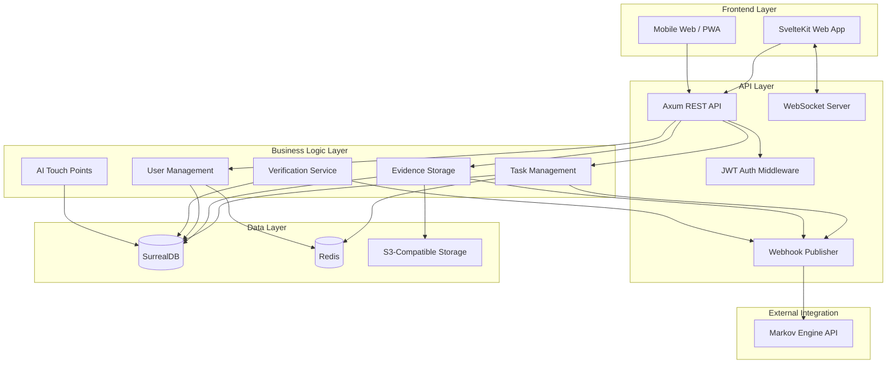

# System Overview

## Introduction

Gotong Royong is a mutual credit platform that tracks physical and digital task completion with cryptographic proof validation. It integrates natively with the Markov Credential Engine for reputation calculation and verification consensus.

## High-Level Architecture



## Technology Stack

**Locked** — see [ADR-001](adr/ADR-001-rust-axum-surrealdb-stack-lock.md) for the full decision record.

| Layer | Technology |
|-------|-----------|
| **Language** | Rust 2024 edition, MSRV 1.88.0 |
| **HTTP Framework** | Axum 0.7 + Tokio async runtime + Tower/tower-http middleware |
| **Database** | SurrealDB `=3.0.0` (TiKV engine in prod, in-memory in dev) |
| **Cache / Rate Limiting** | Redis 7+ (idempotency keys, rate controls, ephemeral fanout) |
| **Object Storage** | S3-compatible (AWS S3 / MinIO / DigitalOcean Spaces) |
| **Auth** | JWT (access + refresh tokens) + HMAC-SHA256 webhook signatures |
| **Realtime** | WebSocket primary; SSE + polling fallbacks |
| **Frontend** | SvelteKit 2, Svelte 5 runes, Tailwind CSS, shadcn-svelte, Paraglide i18n |
| **Frontend Runtime** | Bun |
| **Containerization** | Docker + Docker Compose (dev), Kubernetes (prod) |

## Core Modules

### 1. Task Management

**Purpose**: Create, assign, and track community task completion

**Responsibilities**:
- Task CRUD operations
- Assignment to contributors
- Adaptive path lifecycle (AI-proposed phases and checkpoints — see [AI Spec](../design/specs/AI-SPEC-v0.2.md))
- Skill tagging via ESCO codes
- Task history and audit trail

**Key Entities** (SurrealDB):
- `task` — id, title, description, status, creator_id, adaptive_path
- `task_skill` — task_id, esco_code, label, relevance
- `task_metadata` — location, duration, complexity, track_hint

### 2. Evidence Storage

**Purpose**: Store and validate Proof of Reality (PoR) evidence

**Responsibilities**:
- Evidence file upload (photos, GPS logs, documents) via S3 presigned URLs
- Metadata extraction (EXIF, GPS coordinates, timestamps) in Rust using `kamadak-exif`
- SHA-256 hash computation and integrity verification
- Evidence linking to contributions
- Immutable audit trail in SurrealDB

**Key Entities**:
- `evidence` — id, contribution_id, evidence_type, file_url, media_hash, timestamp
- `evidence_metadata` — lat, lon, camera_model, altitude, witnesses

**Storage**:
- **Files**: S3-compatible object storage (immutable, lifecycle policies for archival)
- **Metadata**: SurrealDB (`evidence_metadata` records linked to `evidence`)
- **Integrity**: SHA-256 hashes stored alongside every file record

### 3. User Management

**Purpose**: Manage contributor accounts and profiles

**Responsibilities**:
- User registration and JWT authentication
- Profile management (bio, skills, contact)
- Reputation display (queried from Markov Engine)
- Contribution history
- Vouch relationships

**Key Entities**:
- `user` — id, username, email, password_hash, markov_user_id
- `user_profile` — bio, location, skills, avatar_url
- `user_reputation` — cached J-Score and tier from Markov Engine

**Authentication**:
- JWT tokens (15-minute access, 7-day refresh)
- HMAC-SHA256 for outbound webhook signatures
- Argon2id password hashing

### 4. Webhook Publisher

**Purpose**: Publish events to Markov Engine for reputation updates

**Responsibilities**:
- Event serialization to canonical JSON
- HMAC-SHA256 signature generation
- HTTP POST to Markov webhook endpoint via `reqwest`
- Retry logic with exponential backoff (Tokio tasks)
- Dead-letter queue via Redis for failed events

**Event Types**:
- `contribution_created` — task completed with PoR evidence
- `vouch_submitted` — peer endorsement
- `por_evidence` — standalone evidence submission

**Delivery Guarantees**:
- At-least-once delivery
- Idempotency via `event_id` (stored in Redis with TTL)
- DLQ depth monitored via Prometheus gauge

### 5. AI Touch Points

**Purpose**: LLM-assisted community intelligence (10 touch points — see [AI Spec](../design/specs/AI-SPEC-v0.2.md))

**Key interactions**:
- **AI-00 (Catatan Saksi)**: Conversational story collection; proposes adaptive path plan
- **AI-01 (Triple Refinement)**: Validates RDF triples, generates track_hint, ESCO skills
- **AI-03 (Duplicate Check)**: Vector similarity search before seed creation
- **AI-08 (Media Scan)**: Sensitive content detection on uploaded images

AI calls are routed through the Axum API layer; models are Haiku-class (fast) or Sonnet-class (reasoning) per touch point budget.

## Integration Points

### Markov Engine Integration

**Mode**: Native (Trusted Platform — Gotong Royong controls its own database; Markov receives webhooks and serves read APIs with transparent auto-linking)

**Flow**:
```
Gotong Royong → Webhook Event → Markov Engine API → Reputation Update
```

**Endpoints consumed**:
- `POST /api/v1/platforms/gotong_royong/webhook` — Markov receives events
- `GET /api/v1/users/{user_id}/reputation` — Gotong queries reputation
- `GET /api/v1/users/{user_id}/tier`
- `GET /api/v1/cv-hidup/{user_id}`
- `GET /api/v1/reputation/leaderboard`
- `GET /api/v1/skills/search` — optional UX enrichment
- `GET /api/v1/por/requirements` — PoR UX guidance

**Authentication**: HMAC-SHA256 webhook signatures + platform service token for read APIs

**Tandang Signals** (planned — not yet implemented):
- Pattern Observed, Collective Vouch, J-Score, Genesis Decay, Consistency Multiplier

**Reference**: [Integration Architecture](integration-architecture.md), [Full Integration Spec](tandang-full-integration.md)

## Data Flow

See [Data Flow](data-flow.md) for detailed sequence diagrams.

## Scalability Considerations

### Horizontal Scaling
- Stateless Axum API servers behind load balancer
- SurrealDB TiKV engine handles distributed storage in production
- Redis cluster for cache, idempotency, and rate limiting
- S3 for distributed file storage

### Performance Targets
- API response time: <200ms (p95)
- Webhook delivery: <5s (p95)
- Evidence upload: <2s for 10MB file (direct-to-S3 presigned URL flow)
- Concurrent users: 10,000+ (with Redis caching)

### Bottlenecks
- **Database writes**: SurrealDB TiKV handles horizontal scaling; use connection pooling in the Rust client
- **Evidence uploads**: Stream directly to S3 via presigned URLs (API never proxies file bytes)
- **Webhook delivery**: Background Tokio tasks with Redis-backed DLQ

## Security Architecture

- **Transport**: TLS 1.3 for all connections
- **Authentication**: JWT with short expiration (15-min access, 7-day refresh)
- **Password Hashing**: Argon2id (memory-hard, OWASP-recommended)
- **Authorization**: Role-based access control (RBAC) via Axum middleware
- **Webhook Security**: HMAC-SHA256 signatures with constant-time comparison (`subtle` crate)
- **Data Encryption**: AES-256 for data at rest (S3 SSE, SurrealDB field encryption)
- **Secrets Management**: HashiCorp Vault / AWS Secrets Manager

See [Security Checklist](../deployment/security-checklist.md) for complete hardening guide.

## Deployment Architecture

### Development
```
Docker Compose
├── Gotong API (cargo watch, hot-reload)
├── SurrealDB (in-memory mode)
├── Redis
└── MinIO (local S3)
```

### Production
```
Kubernetes Cluster
├── API Pods (Axum, replicas: 3)
├── Worker Pods (Tokio background tasks, replicas: 2)
├── SurrealDB (TiKV cluster or managed)
├── Redis (managed instance)
└── S3 (managed storage)
```

See [Infrastructure](../deployment/infrastructure.md) for detailed deployment options.

## Monitoring and Observability

**Instrumentation**: `metrics` + `metrics-exporter-prometheus` crates; `tracing` + `tracing-subscriber` for structured logs.

**Metrics**:
- Request throughput and latency (p50, p95, p99)
- Error rate
- `gotong_worker_webhook_delivery_total{result,status_code}`
- `gotong_worker_webhook_dead_letter_total`
- SurrealDB connection pool utilization
- Evidence validation failures

**Logs**:
- Structured JSON via `tracing` (request_id, user_id, event fields)
- Audit logs for task completion, evidence submission, vouch events

**Alerting**:
- Error rate > 1%
- Latency p95 > 500ms
- Webhook delivery success < 95%
- DLQ depth > 50

See [Monitoring](../deployment/monitoring.md) for implementation details.

## Development Workflow

1. **Local Setup**: Docker Compose for SurrealDB, Redis, MinIO; `cargo watch` for API hot-reload
2. **Frontend**: `bun dev` in `apps/web/`
3. **Feature Development**: Feature branches + pull requests
4. **Testing**: `cargo test` (unit + integration); `just test` for full suite
5. **Code Review**: At least 1 approval required
6. **Staging Deployment**: Automatic on merge to `main`
7. **Production Deployment**: Manual approval + canary deployment

See [Local Development](../development/local-development.md) for setup instructions.

## Implementation Entry Points

1. Set up local environment ([Setup Guide](../development/setup-guide.md))
2. Review database schema ([Schema Requirements](../database/schema-requirements.md))
3. Implement webhook publisher ([Webhook Spec](../api/webhook-spec.md))
4. Build PoR evidence validator ([Validation Rules](../por-evidence/validation-rules.md))
5. Deploy to staging ([Infrastructure](../deployment/infrastructure.md))
