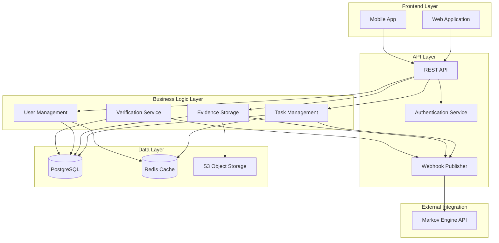

# System Overview

## Introduction

Gotong Royong is a mutual credit platform that tracks physical and digital task completion with cryptographic proof validation. It integrates natively with the Markov Credential Engine for reputation calculation and verification consensus.

## High-Level Architecture



## Core Modules

### 1. Task Management
**Purpose**: Create, assign, and track task completion

**Responsibilities**:
- Task CRUD operations
- Task assignment to contributors
- Completion status tracking
- Skill tagging and categorization
- Task history and audit trail

**Key Entities**:
- Task (id, title, description, status, creator_id, assignee_id, created_at, completed_at)
- TaskSkill (task_id, skill_id)
- TaskMetadata (location, duration, complexity)

**Tech Stack Options**:
- **Node.js**: Express + TypeORM
- **Rust**: Actix-web + Diesel/SQLx
- **Python**: FastAPI + SQLAlchemy

### 2. Evidence Storage
**Purpose**: Store and validate Proof of Reality (PoR) evidence

**Responsibilities**:
- Evidence file upload (photos, GPS logs, documents)
- Evidence metadata extraction (EXIF, GPS coordinates, timestamps)
- Hash computation and integrity verification
- Evidence linking to contributions
- Immutable audit trail

**Key Entities**:
- Evidence (id, contribution_id, evidence_type, file_url, media_hash, timestamp)
- EvidenceMetadata (lat, lon, camera_model, altitude, witnesses)

**Storage Backend**:
- **Primary**: S3-compatible object storage (AWS S3, MinIO, DigitalOcean Spaces)
- **Metadata**: PostgreSQL for queryable fields
- **Hashes**: SHA-256 for content integrity

### 3. User Management
**Purpose**: Manage contributor accounts and profiles

**Responsibilities**:
- User registration and authentication
- Profile management (bio, skills, contact)
- Reputation display (from Markov Engine)
- Contribution history
- Vouch relationships

**Key Entities**:
- User (id, username, email, password_hash, markov_user_id)
- UserProfile (bio, location, skills, avatar_url)
- UserReputation (cached from Markov Engine)

**Authentication**:
- JWT tokens for session management
- HMAC-SHA256 for webhook signatures
- Optional OAuth2 for social login

### 4. Webhook Publisher
**Purpose**: Publish events to Markov Engine for reputation updates

**Responsibilities**:
- Event serialization to JSON
- HMAC-SHA256 signature generation
- HTTP POST to Markov webhook endpoint
- Retry logic with exponential backoff
- Event delivery confirmation

**Event Types**:
- `contribution_created` - Task completed
- `vouch_submitted` - Peer endorsement
- `por_evidence` - Evidence submitted

**Delivery Guarantees**:
- At-least-once delivery
- Idempotency via event IDs
- Dead letter queue for failed events

## Technology Stack

### Backend Framework (Choose One)

| Framework | Pros | Cons | Use When |
|-----------|------|------|----------|
| **Node.js + Express** | Fast development, large ecosystem, JSON-native | Less type-safe, memory management | Team familiar with JS/TS |
| **Rust + Actix-web** | Blazing performance, memory safety, robust | Steeper learning curve | Performance-critical |
| **Python + FastAPI** | Rapid prototyping, excellent docs, async | Slower than Rust/Node | Data-heavy operations |
| **Go + Gin** | Simple deployment, good concurrency | Less ecosystem than Node | Microservices architecture |

**Recommendation**: Start with **Node.js + TypeScript + Express** for rapid iteration, then migrate performance-critical paths to Rust if needed.

### Database

**Primary**: PostgreSQL 14+
- JSONB support for flexible metadata
- PostGIS extension for GPS queries
- Native UUID support
- Excellent performance for OLTP workloads

**Caching**: Redis 7+
- User session caching
- Reputation score caching
- Frequently accessed task lists
- Rate limiting counters

### Object Storage

**Requirement**: S3-compatible API

**Options**:
- AWS S3 (production)
- MinIO (self-hosted, open-source)
- DigitalOcean Spaces (cost-effective)
- Backblaze B2 (low-cost archival)

**Features Needed**:
- Immutable object storage
- Pre-signed URLs for secure uploads
- Lifecycle policies for archival
- CDN integration for global delivery

### Infrastructure

**Container Runtime**: Docker + Docker Compose (development), Kubernetes (production)

**CI/CD**: GitHub Actions / GitLab CI

**Monitoring**: Prometheus + Grafana

**Logging**: Structured JSON logs → ELK Stack / Loki

## Integration Points

### Markov Engine Integration

**Mode**: Native (direct database access from Markov, webhooks from Gotong Royong)

**Flow**:
```
Gotong Royong → Webhook Event → Markov Engine API → Reputation Update
```

**Endpoints**:
- **POST** `/api/v1/platforms/gotong_royong/webhook` (Markov receives events)
- **GET** `/api/v1/users/{user_id}/reputation` (Gotong Royong queries reputation)

**Authentication**: HMAC-SHA256 webhook signatures

**Reference**: [Integration Architecture](integration-architecture.md)

## Data Flow

See [Data Flow](data-flow.md) for detailed sequence diagrams.

## Scalability Considerations

### Horizontal Scaling
- Stateless API servers behind load balancer
- Database connection pooling (PgBouncer)
- Redis cluster for cache distribution
- S3 for distributed file storage

### Performance Targets
- API response time: <200ms (p95)
- Webhook delivery: <5s (p95)
- Evidence upload: <2s for 10MB file
- Concurrent users: 10,000+ (with caching)

### Bottlenecks
- **Database writes**: Use connection pooling, consider read replicas
- **Evidence uploads**: Stream directly to S3 (presigned URLs)
- **Webhook delivery**: Background job queue (Bull, Celery)

## Security Architecture

- **Transport**: TLS 1.3 for all connections
- **Authentication**: JWT with short expiration (15 min access, 7 day refresh)
- **Authorization**: Role-based access control (RBAC)
- **Webhook Security**: HMAC-SHA256 signatures
- **Data Encryption**: AES-256 for data at rest (S3, database)
- **Secrets Management**: HashiCorp Vault / AWS Secrets Manager

See [Security Checklist](../deployment/security-checklist.md) for complete hardening guide.

## Deployment Architecture

### Development
```
Docker Compose (API + PostgreSQL + Redis + MinIO)
```

### Production
```
Kubernetes Cluster
├── API Pods (replicas: 3)
├── Worker Pods (background jobs, replicas: 2)
├── PostgreSQL (RDS or managed instance)
├── Redis (ElastiCache or managed)
└── S3 (managed storage)
```

See [Infrastructure](../deployment/infrastructure.md) for detailed deployment options.

## Monitoring and Observability

**Metrics**:
- Request throughput (requests/sec)
- Error rate (%)
- Response latency (p50, p95, p99)
- Database connection pool utilization
- Webhook delivery success rate
- Evidence validation failures

**Logs**:
- Structured JSON format
- Request/response logging (excluding sensitive data)
- Error stack traces
- Audit logs (task completion, evidence submission)

**Alerting**:
- Error rate > 1%
- Latency p95 > 500ms
- Webhook delivery failures > 5%
- Database connection saturation

See [Monitoring](../deployment/monitoring.md) for implementation details.

## Development Workflow

1. **Local Setup**: Docker Compose for all services
2. **Feature Development**: Feature branches + pull requests
3. **Testing**: Unit tests + integration tests + E2E tests
4. **Code Review**: At least 1 approval required
5. **Staging Deployment**: Automatic on merge to `develop`
6. **Production Deployment**: Manual approval + canary deployment

See [Local Development](../development/local-development.md) for setup instructions.

## Next Steps

For implementation:
1. Choose tech stack based on team expertise
2. Set up database schema (see [Schema Requirements](../database/schema-requirements.md))
3. Implement webhook publisher (see [Webhook Spec](../api/webhook-spec.md))
4. Build PoR evidence validator (see [Validation Rules](../por-evidence/validation-rules.md))
5. Deploy to staging environment (see [Infrastructure](../deployment/infrastructure.md))
