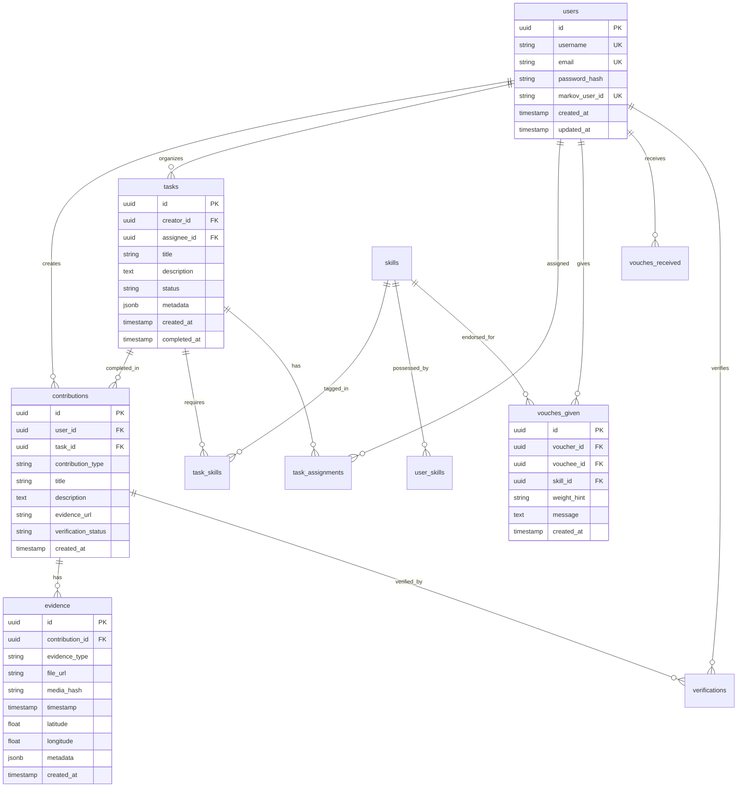

# Database Schema Requirements

## Overview

This document specifies the required database tables, relationships, indexes, and constraints for the Gotong Royong platform.

## Database Selection

**Primary**: PostgreSQL 14+

**Reasons**:
- JSONB support for flexible metadata storage
- PostGIS extension for geospatial queries
- Excellent performance for OLTP workloads
- Native UUID support
- Strong ACID guarantees

**MySQL Support**: Schema is compatible with MySQL 8.0+ with minor adjustments (noted where applicable).

## Entity Relationship Diagram



## Core Tables

### 1. users

Stores user accounts and profiles.

```sql
CREATE TABLE users (
  id UUID PRIMARY KEY DEFAULT gen_random_uuid(),
  username VARCHAR(50) NOT NULL UNIQUE,
  email VARCHAR(255) NOT NULL UNIQUE,
  password_hash VARCHAR(255) NOT NULL,
  markov_user_id VARCHAR(100) UNIQUE,  -- gotong_royong:{user_id}
  bio TEXT,
  location VARCHAR(255),
  avatar_url TEXT,
  created_at TIMESTAMP DEFAULT NOW(),
  updated_at TIMESTAMP DEFAULT NOW()
);

CREATE INDEX idx_users_username ON users(username);
CREATE INDEX idx_users_email ON users(email);
CREATE INDEX idx_users_markov_id ON users(markov_user_id);
```

**Fields**:
- `id`: Primary key (UUID)
- `username`: Display name, unique, 3-50 characters
- `email`: Email address, unique, used for login
- `password_hash`: Bcrypt/Argon2 hashed password
- `markov_user_id`: Platform user ID in Markov Engine (`gotong_royong:{id}`)
- `bio`: User bio (max 500 characters)
- `location`: User location (city, country)
- `avatar_url`: S3 URL to avatar image
- `created_at`: Account creation timestamp
- `updated_at`: Last profile update timestamp

**MySQL Adjustments**:
```sql
-- Replace gen_random_uuid() with UUID()
id CHAR(36) PRIMARY KEY DEFAULT (UUID())
```

### 2. tasks

Stores task definitions and status.

```sql
CREATE TABLE tasks (
  id UUID PRIMARY KEY DEFAULT gen_random_uuid(),
  creator_id UUID NOT NULL REFERENCES users(id) ON DELETE CASCADE,
  assignee_id UUID REFERENCES users(id) ON DELETE SET NULL,
  title VARCHAR(200) NOT NULL,
  description TEXT,
  status VARCHAR(20) NOT NULL DEFAULT 'open',
  difficulty VARCHAR(20),  -- easy, intermediate, hard
  location VARCHAR(255),
  estimated_hours DECIMAL(5,2),
  metadata JSONB,
  created_at TIMESTAMP DEFAULT NOW(),
  completed_at TIMESTAMP,

  CONSTRAINT check_status CHECK (status IN ('open', 'assigned', 'in_progress', 'completed', 'cancelled')),
  CONSTRAINT check_difficulty CHECK (difficulty IN ('easy', 'intermediate', 'hard'))
);

CREATE INDEX idx_tasks_creator ON tasks(creator_id);
CREATE INDEX idx_tasks_assignee ON tasks(assignee_id);
CREATE INDEX idx_tasks_status ON tasks(status);
CREATE INDEX idx_tasks_created ON tasks(created_at DESC);
CREATE INDEX idx_tasks_metadata ON tasks USING GIN (metadata);  -- PostgreSQL only
```

**Task Status Values**:
- `open`: Available for claiming
- `assigned`: Assigned to contributor
- `in_progress`: Work started
- `completed`: Task finished
- `cancelled`: Task cancelled

**MySQL Adjustments**:
```sql
-- JSONB → JSON
metadata JSON
-- Remove GIN index (not supported)
```

### 3. task_skills

Junction table linking tasks to required skills.

```sql
CREATE TABLE task_skills (
  task_id UUID NOT NULL REFERENCES tasks(id) ON DELETE CASCADE,
  skill_id UUID NOT NULL REFERENCES skills(id) ON DELETE CASCADE,
  created_at TIMESTAMP DEFAULT NOW(),

  PRIMARY KEY (task_id, skill_id)
);

CREATE INDEX idx_task_skills_skill ON task_skills(skill_id);
```

### 4. task_assignments

Tracks task assignment history.

```sql
CREATE TABLE task_assignments (
  id UUID PRIMARY KEY DEFAULT gen_random_uuid(),
  task_id UUID NOT NULL REFERENCES tasks(id) ON DELETE CASCADE,
  user_id UUID NOT NULL REFERENCES users(id) ON DELETE CASCADE,
  assigned_by UUID REFERENCES users(id) ON DELETE SET NULL,
  assigned_at TIMESTAMP DEFAULT NOW(),
  completed_at TIMESTAMP,
  status VARCHAR(20) DEFAULT 'active',

  CONSTRAINT check_assignment_status CHECK (status IN ('active', 'completed', 'reassigned'))
);

CREATE INDEX idx_task_assignments_task ON task_assignments(task_id);
CREATE INDEX idx_task_assignments_user ON task_assignments(user_id);
CREATE INDEX idx_task_assignments_status ON task_assignments(status);
```

### 5. contributions

Stores completed contributions.

```sql
CREATE TABLE contributions (
  id UUID PRIMARY KEY DEFAULT gen_random_uuid(),
  user_id UUID NOT NULL REFERENCES users(id) ON DELETE CASCADE,
  task_id UUID REFERENCES tasks(id) ON DELETE SET NULL,
  contribution_type VARCHAR(50) NOT NULL,
  title VARCHAR(200) NOT NULL,
  description TEXT,
  evidence_url TEXT,
  verification_status VARCHAR(20) DEFAULT 'pending',
  markov_contribution_id VARCHAR(100) UNIQUE,
  metadata JSONB,
  created_at TIMESTAMP DEFAULT NOW(),

  CONSTRAINT check_verification_status CHECK (verification_status IN ('pending', 'verified', 'rejected'))
);

CREATE INDEX idx_contributions_user ON contributions(user_id);
CREATE INDEX idx_contributions_task ON contributions(task_id);
CREATE INDEX idx_contributions_type ON contributions(contribution_type);
CREATE INDEX idx_contributions_status ON contributions(verification_status);
CREATE INDEX idx_contributions_created ON contributions(created_at DESC);
CREATE INDEX idx_contributions_metadata ON contributions USING GIN (metadata);
```

**Contribution Types**:
- `task_completion`: Physical/digital task
- `code_review`: Code review
- `documentation`: Documentation/guides
- `mentoring`: Teaching/mentorship
- `event_organization`: Event planning
- `community_service`: Volunteer work
- `custom`: Platform-specific

### 6. evidence

Stores Proof of Reality (PoR) evidence.

```sql
CREATE TABLE evidence (
  id UUID PRIMARY KEY DEFAULT gen_random_uuid(),
  contribution_id UUID NOT NULL REFERENCES contributions(id) ON DELETE CASCADE,
  evidence_type VARCHAR(50) NOT NULL,
  file_url TEXT NOT NULL,
  media_hash VARCHAR(128),  -- SHA-256 hash
  timestamp TIMESTAMP NOT NULL,
  latitude DECIMAL(10,8),  -- -90 to 90
  longitude DECIMAL(11,8),  -- -180 to 180
  metadata JSONB,
  created_at TIMESTAMP DEFAULT NOW(),

  CONSTRAINT check_evidence_type CHECK (evidence_type IN ('photo_with_timestamp', 'gps_verification', 'witness_attestation')),
  CONSTRAINT check_latitude CHECK (latitude >= -90 AND latitude <= 90),
  CONSTRAINT check_longitude CHECK (longitude >= -180 AND longitude <= 180)
);

CREATE INDEX idx_evidence_contribution ON evidence(contribution_id);
CREATE INDEX idx_evidence_type ON evidence(evidence_type);
CREATE INDEX idx_evidence_hash ON evidence(media_hash);
CREATE INDEX idx_evidence_timestamp ON evidence(timestamp DESC);
CREATE INDEX idx_evidence_location ON evidence(latitude, longitude);  -- For geospatial queries
CREATE INDEX idx_evidence_metadata ON evidence USING GIN (metadata);
```

**PostGIS Extension** (optional, for advanced geospatial queries):
```sql
-- Enable PostGIS
CREATE EXTENSION IF NOT EXISTS postgis;

-- Add geometry column
ALTER TABLE evidence ADD COLUMN location GEOGRAPHY(POINT, 4326);

-- Create spatial index
CREATE INDEX idx_evidence_location_spatial ON evidence USING GIST (location);

-- Populate from lat/lon
UPDATE evidence
SET location = ST_SetSRID(ST_MakePoint(longitude, latitude), 4326)
WHERE latitude IS NOT NULL AND longitude IS NOT NULL;
```

### 7. witnesses

Stores witness attestations.

```sql
CREATE TABLE witnesses (
  id UUID PRIMARY KEY DEFAULT gen_random_uuid(),
  evidence_id UUID NOT NULL REFERENCES evidence(id) ON DELETE CASCADE,
  witness_id VARCHAR(100),  -- May be user_id or external ID
  witness_name VARCHAR(255) NOT NULL,
  relationship VARCHAR(50),  -- supervisor, peer, beneficiary, other
  statement TEXT,
  created_at TIMESTAMP DEFAULT NOW()
);

CREATE INDEX idx_witnesses_evidence ON witnesses(evidence_id);
CREATE INDEX idx_witnesses_witness_id ON witnesses(witness_id);
```

### 8. vouches

Stores peer endorsements.

```sql
CREATE TABLE vouches (
  id UUID PRIMARY KEY DEFAULT gen_random_uuid(),
  voucher_id UUID NOT NULL REFERENCES users(id) ON DELETE CASCADE,
  vouchee_id UUID NOT NULL REFERENCES users(id) ON DELETE CASCADE,
  skill_id UUID REFERENCES skills(id) ON DELETE SET NULL,
  weight_hint VARCHAR(20),
  message TEXT,
  markov_vouch_id VARCHAR(100) UNIQUE,
  created_at TIMESTAMP DEFAULT NOW(),

  CONSTRAINT check_weight_hint CHECK (weight_hint IN ('strong', 'moderate', 'light')),
  CONSTRAINT check_not_self_vouch CHECK (voucher_id != vouchee_id)
);

CREATE INDEX idx_vouches_voucher ON vouches(voucher_id);
CREATE INDEX idx_vouches_vouchee ON vouches(vouchee_id);
CREATE INDEX idx_vouches_skill ON vouches(skill_id);
CREATE INDEX idx_vouches_created ON vouches(created_at DESC);

-- Unique constraint: one vouch per skill per pair
CREATE UNIQUE INDEX idx_vouches_unique ON vouches(voucher_id, vouchee_id, skill_id)
WHERE skill_id IS NOT NULL;
```

### 9. verifications

Stores verification records for contributions.

```sql
CREATE TABLE verifications (
  id UUID PRIMARY KEY DEFAULT gen_random_uuid(),
  contribution_id UUID NOT NULL REFERENCES contributions(id) ON DELETE CASCADE,
  verifier_id UUID NOT NULL REFERENCES users(id) ON DELETE CASCADE,
  outcome VARCHAR(20) NOT NULL,
  evidence_quality_score DECIMAL(3,2),  -- 0.00 to 1.00
  notes TEXT,
  created_at TIMESTAMP DEFAULT NOW(),

  CONSTRAINT check_outcome CHECK (outcome IN ('approved', 'rejected', 'pending')),
  CONSTRAINT check_score CHECK (evidence_quality_score >= 0 AND evidence_quality_score <= 1)
);

CREATE INDEX idx_verifications_contribution ON verifications(contribution_id);
CREATE INDEX idx_verifications_verifier ON verifications(verifier_id);
CREATE INDEX idx_verifications_outcome ON verifications(outcome);
CREATE INDEX idx_verifications_created ON verifications(created_at DESC);
```

### 10. skills

Stores skill taxonomy.

```sql
CREATE TABLE skills (
  id UUID PRIMARY KEY DEFAULT gen_random_uuid(),
  name VARCHAR(100) NOT NULL UNIQUE,
  category VARCHAR(50),
  description TEXT,
  created_at TIMESTAMP DEFAULT NOW()
);

CREATE INDEX idx_skills_name ON skills(name);
CREATE INDEX idx_skills_category ON skills(category);
```

**Example Skills**:
- Gardening: organic_farming, soil_preparation, composting
- Logistics: delivery, warehouse_management, route_optimization
- Community: event_organization, conflict_resolution, fundraising

### 11. user_skills

Junction table for user skill proficiency.

```sql
CREATE TABLE user_skills (
  user_id UUID NOT NULL REFERENCES users(id) ON DELETE CASCADE,
  skill_id UUID NOT NULL REFERENCES skills(id) ON DELETE CASCADE,
  proficiency_level DECIMAL(3,2) DEFAULT 0.00,  -- 0.00 to 1.00
  endorsements_count INT DEFAULT 0,
  created_at TIMESTAMP DEFAULT NOW(),
  updated_at TIMESTAMP DEFAULT NOW(),

  PRIMARY KEY (user_id, skill_id),
  CONSTRAINT check_proficiency CHECK (proficiency_level >= 0 AND proficiency_level <= 1)
);

CREATE INDEX idx_user_skills_user ON user_skills(user_id);
CREATE INDEX idx_user_skills_skill ON user_skills(skill_id);
CREATE INDEX idx_user_skills_proficiency ON user_skills(proficiency_level DESC);
```

## Supporting Tables

### 12. webhook_events

Queue for outgoing webhook events.

```sql
CREATE TABLE webhook_events (
  id UUID PRIMARY KEY DEFAULT gen_random_uuid(),
  event_id VARCHAR(50) NOT NULL UNIQUE,
  event_type VARCHAR(50) NOT NULL,
  payload JSONB NOT NULL,
  status VARCHAR(20) DEFAULT 'pending',
  attempts INT DEFAULT 0,
  last_attempt_at TIMESTAMP,
  error_message TEXT,
  created_at TIMESTAMP DEFAULT NOW(),

  CONSTRAINT check_webhook_status CHECK (status IN ('pending', 'processing', 'delivered', 'failed'))
);

CREATE INDEX idx_webhook_events_status ON webhook_events(status);
CREATE INDEX idx_webhook_events_type ON webhook_events(event_type);
CREATE INDEX idx_webhook_events_created ON webhook_events(created_at DESC);
CREATE INDEX idx_webhook_events_event_id ON webhook_events(event_id);
```

### 13. webhook_failures

Dead letter queue for failed webhooks.

```sql
CREATE TABLE webhook_failures (
  id UUID PRIMARY KEY DEFAULT gen_random_uuid(),
  event_id VARCHAR(50),
  event_type VARCHAR(50) NOT NULL,
  payload JSONB NOT NULL,
  error_message TEXT,
  status_code INT,
  attempts INT DEFAULT 0,
  last_attempt_at TIMESTAMP,
  created_at TIMESTAMP DEFAULT NOW()
);

CREATE INDEX idx_webhook_failures_type ON webhook_failures(event_type);
CREATE INDEX idx_webhook_failures_created ON webhook_failures(created_at DESC);
```

### 14. reputation_cache

Cached reputation data from Markov Engine.

```sql
CREATE TABLE reputation_cache (
  user_id UUID PRIMARY KEY REFERENCES users(id) ON DELETE CASCADE,
  reputation_score DECIMAL(10,2) NOT NULL,
  tier VARCHAR(50),
  contributions_count INT DEFAULT 0,
  vouches_received INT DEFAULT 0,
  cached_at TIMESTAMP DEFAULT NOW()
);

CREATE INDEX idx_reputation_cache_score ON reputation_cache(reputation_score DESC);
CREATE INDEX idx_reputation_cache_tier ON reputation_cache(tier);
CREATE INDEX idx_reputation_cache_cached_at ON reputation_cache(cached_at);
```

## Indexes Summary

### Performance-Critical Indexes

**Most queried**:
1. `users.username` - User lookup
2. `tasks.status` - Task filtering
3. `contributions.user_id` - User contribution history
4. `evidence.contribution_id` - Evidence lookup
5. `vouches.vouchee_id` - Received vouches

**Composite Indexes** (for common query patterns):
```sql
-- User contributions by status
CREATE INDEX idx_contributions_user_status ON contributions(user_id, verification_status);

-- Open tasks by skill
CREATE INDEX idx_tasks_open_skills ON tasks(status) WHERE status = 'open';

-- Recent user activity
CREATE INDEX idx_contributions_user_recent ON contributions(user_id, created_at DESC);
```

## Constraints Summary

### Foreign Key Constraints

All foreign keys use:
- `ON DELETE CASCADE` - For dependent data (e.g., evidence → contribution)
- `ON DELETE SET NULL` - For optional references (e.g., task → assignee)

### Check Constraints

- Enumerations (status, type fields)
- Range validation (latitude, longitude, scores)
- Business rules (no self-vouching)

## Data Retention

### Retention Policies

| Table | Retention | Reason |
|-------|-----------|--------|
| `users` | Permanent | Core data |
| `contributions` | Permanent | Audit trail |
| `evidence` | 7 years | Legal compliance |
| `webhook_events` | 30 days | Operational data |
| `webhook_failures` | 90 days | Debugging |
| `reputation_cache` | 30 days | Performance cache |

### Archival Query

```sql
-- Archive old webhook events
INSERT INTO webhook_events_archive
SELECT * FROM webhook_events
WHERE created_at < NOW() - INTERVAL '30 days'
AND status = 'delivered';

DELETE FROM webhook_events
WHERE created_at < NOW() - INTERVAL '30 days'
AND status = 'delivered';
```

## Migration Strategy

See [Migrations](migrations.md) for schema versioning and migration procedures.

## Capacity Planning

### Estimated Storage

**Assumptions** (1 year, 10,000 active users):
- Tasks: 50,000 records × 2KB = 100MB
- Contributions: 100,000 records × 3KB = 300MB
- Evidence: 200,000 records × 1KB = 200MB (metadata only, files in S3)
- Vouches: 50,000 records × 500B = 25MB
- Webhook events: Rolling 30 days, ~10MB

**Total Database**: ~1GB/year (excluding indexes)

**S3 Storage** (evidence files):
- 200,000 photos × 2MB avg = 400GB/year

### Connection Pooling

**Recommended Settings** (for 3 API servers):
```
max_connections = 100
per_server_pool_size = 30
total_pool_size = 90
```

## Backup Strategy

**PostgreSQL**:
```bash
# Daily full backup
pg_dump -Fc gotong_royong > backup_$(date +%Y%m%d).dump

# Continuous archiving (WAL)
archive_mode = on
archive_command = 'cp %p /mnt/backup/wal/%f'
```

**MySQL**:
```bash
# Daily backup
mysqldump --single-transaction gotong_royong > backup_$(date +%Y%m%d).sql
```

## Security

### Row-Level Security (PostgreSQL)

```sql
-- Enable RLS
ALTER TABLE contributions ENABLE ROW LEVEL SECURITY;

-- Policy: users can only see their own contributions
CREATE POLICY contributions_select_policy ON contributions
FOR SELECT
USING (user_id = current_setting('app.current_user_id')::UUID);

-- Policy: users can only insert their own contributions
CREATE POLICY contributions_insert_policy ON contributions
FOR INSERT
WITH CHECK (user_id = current_setting('app.current_user_id')::UUID);
```

### Encryption at Rest

**PostgreSQL**:
- Use `pgcrypto` extension for field-level encryption
- Or enable full-disk encryption at OS level

**MySQL**:
- Enable InnoDB tablespace encryption

## References

- [Migrations](migrations.md) - Schema versioning
- [API Event Payloads](../api/event-payloads.md) - Data structures
- [PoR Evidence Format](../por-evidence/evidence-format.md) - Evidence requirements
