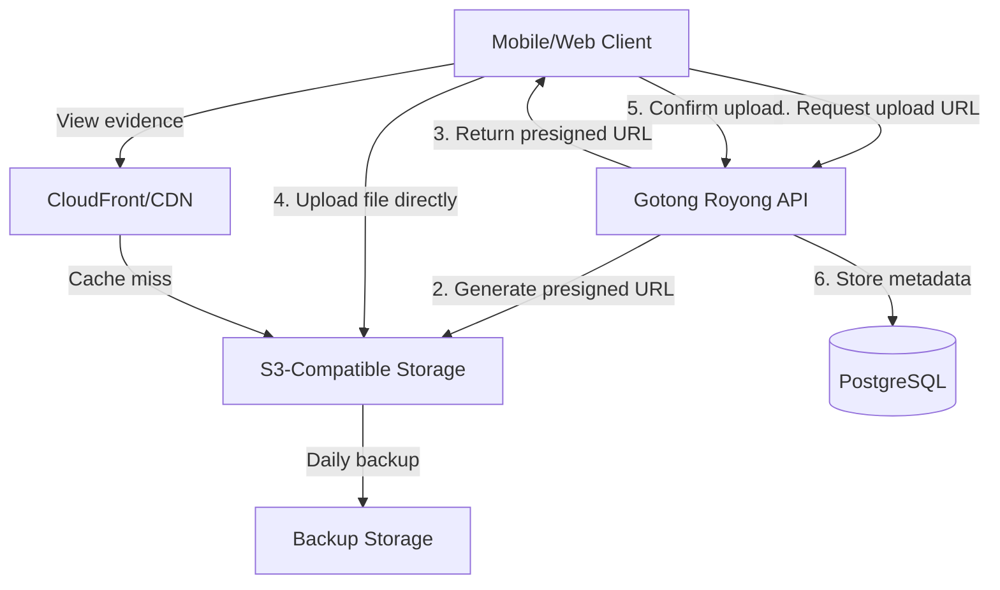

# Storage Requirements

## Overview

This document specifies the storage infrastructure requirements for Proof of Reality (PoR) evidence files, including backend options, retention policies, access control, and disaster recovery.

## Storage Architecture



## Storage Backends

### Recommended: S3-Compatible Object Storage

**Primary Options**:

| Provider | Pros | Cons | Cost (estimate) |
|----------|------|------|-----------------|
| **AWS S3** | Industry standard, reliable, global | Higher cost | $0.023/GB/month |
| **MinIO** | Self-hosted, S3-compatible, free | Requires infrastructure | Server costs only |
| **DigitalOcean Spaces** | Cost-effective, simple | Limited regions | $0.02/GB/month (min $5/mo) |
| **Backblaze B2** | Very low cost, S3-compatible | Slower than S3 | $0.005/GB/month |
| **Cloudflare R2** | Zero egress fees | Newer service | $0.015/GB/month |

**Recommendation**:
- **Production**: AWS S3 (reliability) or Cloudflare R2 (cost)
- **Development**: MinIO (self-hosted)

### Why S3-Compatible?

**Benefits**:
- Industry-standard API
- Immutable object storage (versioning support)
- Pre-signed URLs for secure direct uploads
- Lifecycle policies for archival
- CDN integration for fast global delivery
- Durability: 99.999999999% (11 nines)

## Storage Structure

### Bucket Organization

```
gotong-royong-evidence/
├── photos/
│   ├── 2026/
│   │   ├── 02/
│   │   │   ├── 09/
│   │   │   │   ├── user123_contrib456_photo1.jpg
│   │   │   │   ├── user123_contrib456_photo2.jpg
│   ├── thumbnails/
│   │   ├── 2026/02/09/
│   │       ├── user123_contrib456_photo1_thumb.jpg
├── documents/
│   ├── 2026/02/09/
│       ├── user123_contrib456_doc1.pdf
└── archives/
    ├── 2024/
        └── ...
```

**Naming Convention**:
```
{category}/{year}/{month}/{day}/{user_id}_{contribution_id}_{filename}.{ext}
```

**Example**:
```
photos/2026/02/09/user123_contrib456_evidence1.jpg
```

### Object Metadata

Store metadata as S3 object tags:

```javascript
{
  'user_id': 'user123',
  'contribution_id': 'contrib456',
  'evidence_type': 'photo_with_timestamp',
  'uploaded_at': '2026-02-09T10:30:00Z',
  'media_hash': 'a1b2c3d4...',
  'retention_tier': 'standard'  // standard, archive, deep_archive
}
```

## Upload Flow

### Presigned URLs (Recommended)

**Benefits**:
- Client uploads directly to S3 (faster)
- Reduces API server bandwidth
- Secure (time-limited, signed URLs)
- Automatic retry on failure

**Implementation (Node.js with AWS SDK)**:

```javascript
const AWS = require('aws-sdk');
const s3 = new AWS.S3({
  accessKeyId: process.env.AWS_ACCESS_KEY_ID,
  secretAccessKey: process.env.AWS_SECRET_ACCESS_KEY,
  region: process.env.AWS_REGION,
});

async function generatePresignedUploadUrl(userId, contributionId, fileName) {
  const key = `photos/${new Date().toISOString().split('T')[0].replace(/-/g, '/')}/${userId}_${contributionId}_${fileName}`;

  const params = {
    Bucket: process.env.S3_BUCKET_NAME,
    Key: key,
    Expires: 300, // 5 minutes
    ContentType: 'image/jpeg',
    Metadata: {
      user_id: userId,
      contribution_id: contributionId,
    },
  };

  const uploadUrl = await s3.getSignedUrlPromise('putObject', params);

  return {
    upload_url: uploadUrl,
    file_key: key,
    expires_in: 300,
  };
}

// API endpoint
app.post('/api/evidence/upload-url', async (req, res) => {
  const { contribution_id, file_name } = req.body;
  const user_id = req.user.id;

  const urlData = await generatePresignedUploadUrl(user_id, contribution_id, file_name);

  res.json(urlData);
});
```

**Client Upload (JavaScript)**:

```javascript
async function uploadEvidence(file, contributionId) {
  // Step 1: Get presigned URL
  const response = await fetch('/api/evidence/upload-url', {
    method: 'POST',
    headers: { 'Content-Type': 'application/json' },
    body: JSON.stringify({
      contribution_id: contributionId,
      file_name: file.name,
    }),
  });

  const { upload_url, file_key } = await response.json();

  // Step 2: Upload directly to S3
  await fetch(upload_url, {
    method: 'PUT',
    body: file,
    headers: {
      'Content-Type': file.type,
    },
  });

  // Step 3: Confirm upload to API
  await fetch('/api/evidence/confirm', {
    method: 'POST',
    headers: { 'Content-Type': 'application/json' },
    body: JSON.stringify({
      contribution_id: contributionId,
      file_key: file_key,
    }),
  });

  console.log('Upload complete');
}
```

### Multipart Upload (Large Files)

For files >5MB, use multipart upload:

```javascript
const upload = new AWS.S3.ManagedUpload({
  params: {
    Bucket: process.env.S3_BUCKET_NAME,
    Key: key,
    Body: fileStream,
  },
  partSize: 5 * 1024 * 1024, // 5 MB per part
  queueSize: 4, // 4 concurrent uploads
});

upload.on('httpUploadProgress', (progress) => {
  console.log(`Uploaded ${progress.loaded} of ${progress.total} bytes`);
});

await upload.promise();
```

## File Size Limits

### By File Type

| File Type | Minimum | Maximum | Recommended |
|-----------|---------|---------|-------------|
| Photo (JPEG/PNG) | 50 KB | 10 MB | 2-5 MB |
| Photo (HEIC) | 50 KB | 15 MB | 3-8 MB |
| Document (PDF) | 10 KB | 25 MB | 1-5 MB |
| Video | 100 KB | 100 MB | 20-50 MB |

**Enforcement**:

```javascript
const FILE_SIZE_LIMITS = {
  'image/jpeg': { min: 50 * 1024, max: 10 * 1024 * 1024 },
  'image/png': { min: 50 * 1024, max: 10 * 1024 * 1024 },
  'image/heic': { min: 50 * 1024, max: 15 * 1024 * 1024 },
  'application/pdf': { min: 10 * 1024, max: 25 * 1024 * 1024 },
  'video/mp4': { min: 100 * 1024, max: 100 * 1024 * 1024 },
};

function validateFileSize(fileSize, contentType) {
  const limits = FILE_SIZE_LIMITS[contentType];

  if (!limits) {
    throw new Error(`Unsupported file type: ${contentType}`);
  }

  if (fileSize < limits.min) {
    throw new Error(`File too small: ${fileSize} bytes (min: ${limits.min} bytes)`);
  }

  if (fileSize > limits.max) {
    throw new Error(`File too large: ${fileSize} bytes (max: ${limits.max} bytes)`);
  }

  return true;
}
```

## Access Control

### Bucket Policy (AWS S3)

**Private bucket with presigned URLs**:

```json
{
  "Version": "2012-10-17",
  "Statement": [
    {
      "Sid": "DenyPublicAccess",
      "Effect": "Deny",
      "Principal": "*",
      "Action": "s3:GetObject",
      "Resource": "arn:aws:s3:::gotong-royong-evidence/*",
      "Condition": {
        "StringNotEquals": {
          "aws:UserAgent": "CloudFront"
        }
      }
    }
  ]
}
```

**Block all public access**: Enable in S3 console

### IAM Policy (Application Access)

```json
{
  "Version": "2012-10-17",
  "Statement": [
    {
      "Effect": "Allow",
      "Action": [
        "s3:PutObject",
        "s3:GetObject",
        "s3:DeleteObject"
      ],
      "Resource": "arn:aws:s3:::gotong-royong-evidence/*"
    },
    {
      "Effect": "Allow",
      "Action": [
        "s3:ListBucket"
      ],
      "Resource": "arn:aws:s3:::gotong-royong-evidence"
    }
  ]
}
```

### File Access Control

**Public evidence** (for verification):
- Generate short-lived presigned URLs (15 minutes)
- Serve via CDN with signed URLs

**Private evidence** (sensitive):
- Require authentication token
- Log all access for audit

```javascript
async function generateDownloadUrl(fileKey, expiresIn = 900) {
  const params = {
    Bucket: process.env.S3_BUCKET_NAME,
    Key: fileKey,
    Expires: expiresIn, // 15 minutes
  };

  return s3.getSignedUrlPromise('getObject', params);
}

// API endpoint
app.get('/api/evidence/:file_key/download', async (req, res) => {
  // Verify user has access to this evidence
  const evidence = await db.query('SELECT * FROM evidence WHERE file_key = $1', [req.params.file_key]);

  if (!evidence.rows.length) {
    return res.status(404).json({ error: 'Evidence not found' });
  }

  // Check if user owns the contribution or is a verifier
  const hasAccess = await checkAccess(req.user.id, evidence.rows[0].contribution_id);

  if (!hasAccess) {
    return res.status(403).json({ error: 'Access denied' });
  }

  const downloadUrl = await generateDownloadUrl(req.params.file_key);
  res.json({ download_url: downloadUrl });
});
```

## CDN Integration

### CloudFront Configuration (AWS)

**Benefits**:
- Global edge caching (low latency)
- DDoS protection
- HTTPS termination
- Reduced S3 costs (cache hits)

**Setup**:

```yaml
# cloudfront-distribution.yml
CloudFrontDistribution:
  Type: AWS::CloudFront::Distribution
  Properties:
    DistributionConfig:
      Origins:
        - Id: S3Origin
          DomainName: gotong-royong-evidence.s3.amazonaws.com
          S3OriginConfig:
            OriginAccessIdentity: !Sub origin-access-identity/cloudfront/${CloudFrontOAI}
      DefaultCacheBehavior:
        TargetOriginId: S3Origin
        ViewerProtocolPolicy: redirect-to-https
        AllowedMethods: [GET, HEAD, OPTIONS]
        CachedMethods: [GET, HEAD]
        Compress: true
        DefaultTTL: 86400  # 1 day
        MaxTTL: 31536000   # 1 year
      PriceClass: PriceClass_100  # Use only North America and Europe
      ViewerCertificate:
        AcmCertificateArn: !Ref SSLCertificate
        SslSupportMethod: sni-only
```

**Signed URLs** (for private content):

```javascript
const cloudfront = new AWS.CloudFront.Signer(
  process.env.CLOUDFRONT_KEY_PAIR_ID,
  process.env.CLOUDFRONT_PRIVATE_KEY
);

function generateSignedUrl(url, expiresIn = 900) {
  const expires = Math.floor(Date.now() / 1000) + expiresIn;

  return cloudfront.getSignedUrl({
    url: url,
    expires: expires,
  });
}
```

## Retention and Lifecycle Policies

### Retention Tiers

| Tier | Duration | Storage Class | Use Case |
|------|----------|---------------|----------|
| **Hot** | 0-90 days | STANDARD | Recent evidence, active verification |
| **Warm** | 90 days - 2 years | STANDARD_IA | Historical evidence, occasional access |
| **Cold** | 2-7 years | GLACIER | Long-term archival, compliance |
| **Deep Archive** | >7 years | DEEP_ARCHIVE | Legal holds, permanent records |

### Lifecycle Policy (AWS S3)

```json
{
  "Rules": [
    {
      "Id": "TransitionToIA",
      "Status": "Enabled",
      "Transitions": [
        {
          "Days": 90,
          "StorageClass": "STANDARD_IA"
        }
      ]
    },
    {
      "Id": "TransitionToGlacier",
      "Status": "Enabled",
      "Transitions": [
        {
          "Days": 730,
          "StorageClass": "GLACIER"
        }
      ]
    },
    {
      "Id": "TransitionToDeepArchive",
      "Status": "Enabled",
      "Transitions": [
        {
          "Days": 2555,
          "StorageClass": "DEEP_ARCHIVE"
        }
      ]
    },
    {
      "Id": "DeleteAfter10Years",
      "Status": "Enabled",
      "Expiration": {
        "Days": 3650
      }
    }
  ]
}
```

### Legal Requirements

**Minimum retention**: 7 years (compliance with financial/legal regulations)

**Immutability**: Use S3 Object Lock for tamper-proof evidence

```javascript
const params = {
  Bucket: process.env.S3_BUCKET_NAME,
  Key: fileKey,
  ObjectLockMode: 'GOVERNANCE', // or 'COMPLIANCE'
  ObjectLockRetainUntilDate: new Date(Date.now() + 7 * 365 * 24 * 60 * 60 * 1000), // 7 years
};

await s3.putObjectRetention(params).promise();
```

## Backup Strategy

### Primary Backup

**Frequency**: Daily incremental, weekly full

**Destination**: Separate AWS account or region

**Implementation**:

```bash
# AWS S3 Cross-Region Replication
aws s3api put-bucket-replication \
  --bucket gotong-royong-evidence \
  --replication-configuration file://replication-config.json
```

**replication-config.json**:
```json
{
  "Role": "arn:aws:iam::ACCOUNT-ID:role/S3ReplicationRole",
  "Rules": [
    {
      "Status": "Enabled",
      "Priority": 1,
      "Filter": {},
      "Destination": {
        "Bucket": "arn:aws:s3:::gotong-royong-evidence-backup",
        "ReplicationTime": {
          "Status": "Enabled",
          "Time": {
            "Minutes": 15
          }
        }
      }
    }
  ]
}
```

### Disaster Recovery

**RTO** (Recovery Time Objective): 4 hours

**RPO** (Recovery Point Objective): 24 hours

**DR Plan**:
1. Detect primary region failure
2. Switch DNS to backup region
3. Restore from latest backup
4. Validate data integrity
5. Resume operations

## Cost Optimization

### Estimated Costs (10,000 users, 1 year)

**Assumptions**:
- 200,000 photos/year
- 2 MB average file size
- 400 GB total storage

**AWS S3 Costs**:
```
Storage (STANDARD): 400 GB × $0.023/GB = $9.20/month
Lifecycle transitions: ~$0.50/month
PUT requests: 200,000 × $0.005/1000 = $1.00/month
GET requests (with CDN): 1M × $0.0004/1000 = $0.40/month

Total: ~$11/month ($132/year)
```

**With CDN (CloudFront)**:
```
Data transfer out: 1 TB/month × $0.085/GB = $85/month
Total with CDN: ~$96/month ($1,152/year)
```

**Cloudflare R2 (Alternative)**:
```
Storage: 400 GB × $0.015/GB = $6/month
Zero egress fees
Total: $6/month ($72/year) - 83% savings
```

### Cost Reduction Tips

1. **Compress images** before upload (reduce size by 40-60%)
2. **Use lifecycle policies** (move old files to cheaper tiers)
3. **Enable CloudFront caching** (reduce S3 GET requests)
4. **Delete thumbnails after 90 days** (regenerate on demand)
5. **Use Cloudflare R2** instead of S3 (zero egress fees)

## Security Best Practices

1. **Encrypt at rest**: Enable S3 default encryption (AES-256)
2. **Encrypt in transit**: HTTPS only (TLS 1.3)
3. **Versioning**: Enable for accidental deletion protection
4. **MFA delete**: Require MFA for permanent deletion
5. **Access logging**: Log all S3 access for auditing
6. **Bucket policies**: Deny public access, use presigned URLs
7. **IAM roles**: Least privilege for application access

## Monitoring

### Metrics to Track

- Storage capacity used (GB)
- Storage cost per month
- Upload success rate
- Download latency (p95)
- CDN cache hit rate
- Failed uploads (by error type)

### CloudWatch Alarms

```javascript
// Storage exceeds 1 TB
{
  "AlarmName": "S3StorageExceeds1TB",
  "MetricName": "BucketSizeBytes",
  "Threshold": 1099511627776,  // 1 TB in bytes
  "ComparisonOperator": "GreaterThanThreshold"
}

// Upload failure rate > 5%
{
  "AlarmName": "HighUploadFailureRate",
  "MetricName": "4xxErrors",
  "Threshold": 5,  // 5% of requests
  "ComparisonOperator": "GreaterThanThreshold"
}
```

## References

- [Evidence Format](evidence-format.md) - File format requirements
- [Validation Rules](validation-rules.md) - Upload validation
- [Infrastructure](../deployment/infrastructure.md) - Deployment architecture
- [Security Checklist](../deployment/security-checklist.md) - Security hardening
